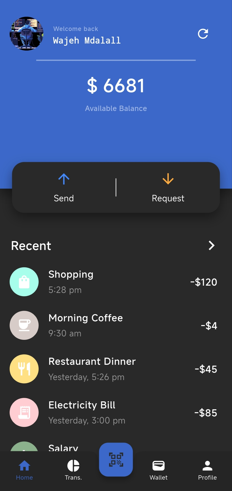
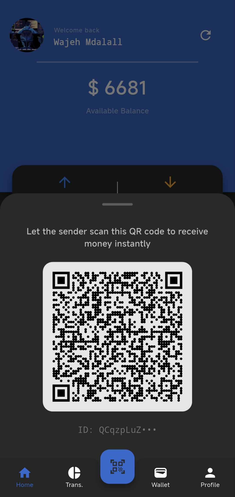
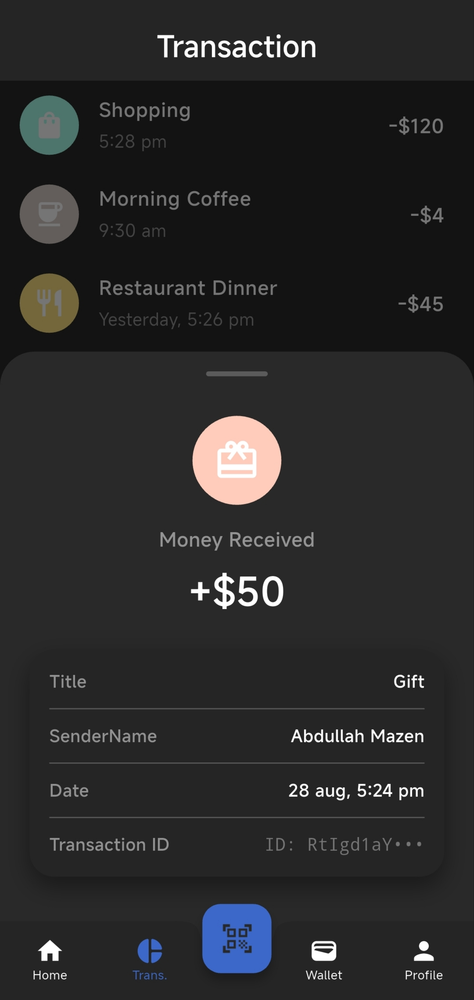
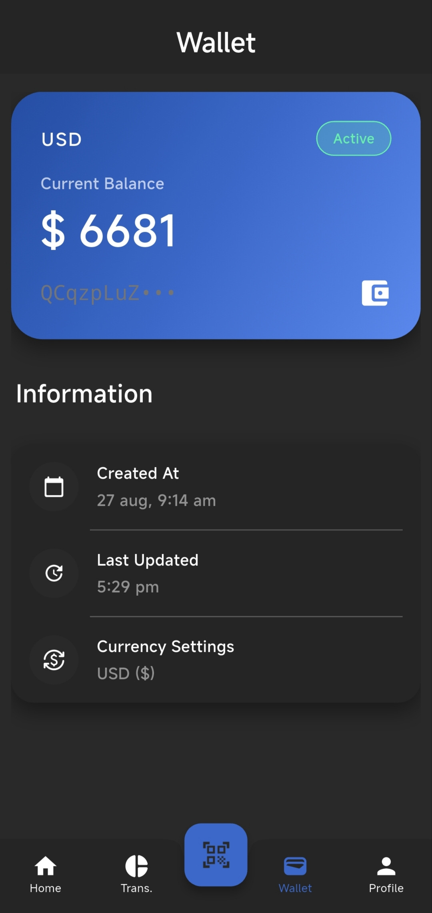
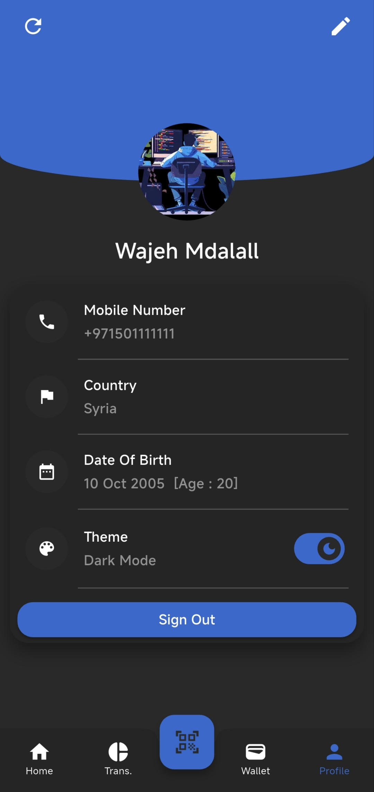

# 📱 Flo Wallet

A secure, modern, and scalable Digital Wallet mobile application built using **Flutter** and **Firebase**. This project strictly adheres to **Clean Architecture** principles and utilizes advanced reactive state management to ensure a robust and maintainable codebase.

---

## 📸 App Showcase

  
  
  
  
  

---

## ✨ Features

- **Secure Authentication:** Phone number registration with dynamic OTP verification flow.
- **Wallet Management:** Real-time balance updates and automated account state tracking.
- **Push Notifications:** Instant FCM push notifications for incoming and outgoing transaction events.
- **Real-Time Transactions:** Dynamic ledger auto-refreshed via active stream listeners upon new events.
- **QR Code Payments:** Fast and secure peer-to-peer money transfers via QR code scanning.
- **User Profile Management:** Customizable user profiles with dynamic avatar picker and search capabilities.
- **Modern UI/UX:** Responsive layouts, custom UI components, clean navigation, and sleek onboarding screens.
- **Advanced Exception Handling:** Robust mapping of remote data sources, Firebase exceptions, and failure states.

---

## 🏗️ Architecture & Tech Stack

This project is built using **Clean Architecture** split into three distinct layers to ensure separation of concerns and high testability:

- **Data Layer:** Handles API/Firebase communication, model parsing (`TransactionModel`, `UserModel`), and remote data sources implementation.
- **Domain Layer:** Contains business logic, entities, and use cases (e.g., `GetWalletUseCase`, `UpdateFcmTokenUseCase`).
- **Presentation Layer:** Built using UI views and **BLoC / Cubit** for reactive and clean state management.

### Key Technologies:
- **Framework:** Flutter & Dart
- **State Management:** BLoC / Cubit
- **Backend & Database:** Firebase Auth, Cloud Firestore, Firebase Transactions (via Flutter SDK), & Firebase Cloud Messaging (FCM)
- **Asynchronous Data:** Reactive Streams (`StreamBuilder` & Stream-driven Cubits) for real-time transaction synchronization.
- **Data Optimization:** Custom pagination logic for loading transaction histories seamlessly without draining memory.
- **Dependency Injection:** Service Locator via `GetIt`
- **Routing:** Declarative navigation with `GoRouter`

---

## 🚀 Download & Try the App

You can download the production-ready application binary directly from the GitHub Releases section. Two optimized builds are available for performance across different Android architectures:

1. Go to the **Releases** section on the right sidebar of this repository.
2. Choose the appropriate APK for your Android device:
   - **`flo-wallet-arm64-v8a.apk`:** Optimized for modern devices (64-bit architecture).
   - **`flo-wallet-armeabi-v7a.apk`:** Optimized for older devices (32-bit architecture).
3. Download, install, and run it on your device.

---

## 🔒 Security & Best Practices

- **Atomic Transactions:** Financial operations utilize client-side Firebase Transactions (`runTransaction`) to guarantee data consistency and prevent race conditions.
- **Configuration Secrets:** Google Cloud credentials (`service_account.json`), `google-services.json`, and environment secrets are fully secured and untracked via `.gitignore`.